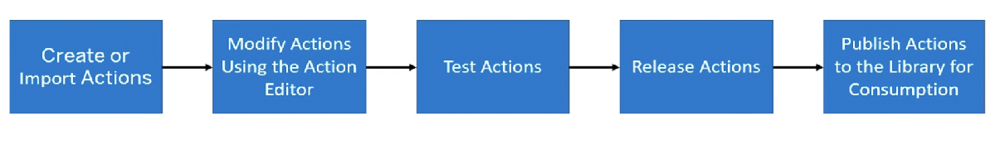
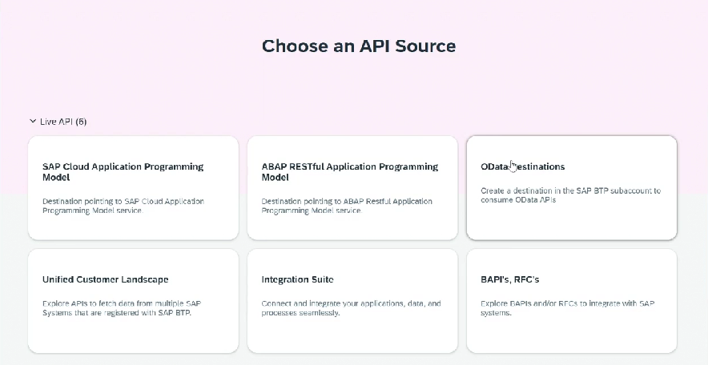
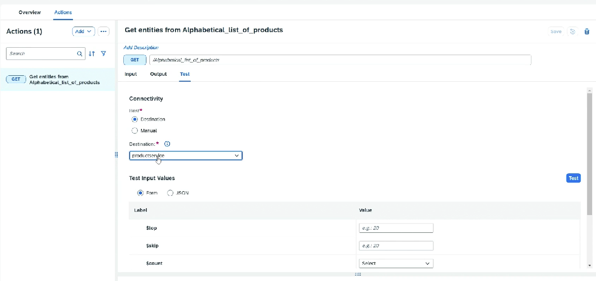

# Action

* Embed external skills and capabilities into SAP BPA project using actions
* Contains specific action artifacts that can be used in managing your business process
*   Action can be resused by multiple projects

    <figure><figcaption></figcaption></figure>
* Build Lobby ⇒ Actions ⇒ Create
* Choose source
*

    <figure><figcaption></figcaption></figure>
* We will be able to see all the methods available inside OData
* Next ⇒ Save
* Go into action ⇒ Check the methods ⇒ Check the data types of input and output
* Test by selecting the destination and selecting the input
* Release once tested and found ok
*   Publish

    <figure><figcaption></figcaption></figure>
