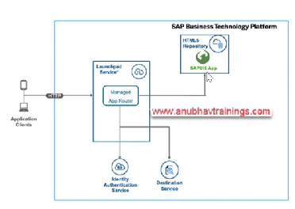
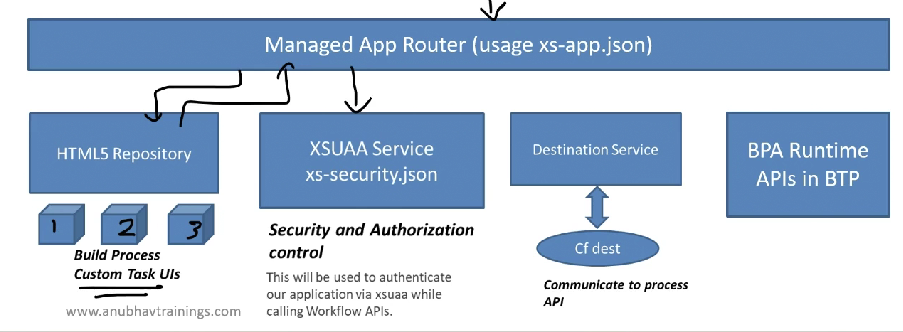

# App Router

* The manager application router enables you to access and run HTML5 applications in a cloud environment without the need to maintain your own runtime infrastructure
* The managed application router is the HTML5 applications runtime capability
* HTML5 application repository enables central storage of HTML5
*

    <figure><figcaption></figcaption></figure>

* The app router will be responsible to communicate between our UI5 module and our BPA runtime API
* Since the app router also usage the XSUAA service, it will only allow authenticated calls to direct to our application
*

    <figure><figcaption></figcaption></figure>
