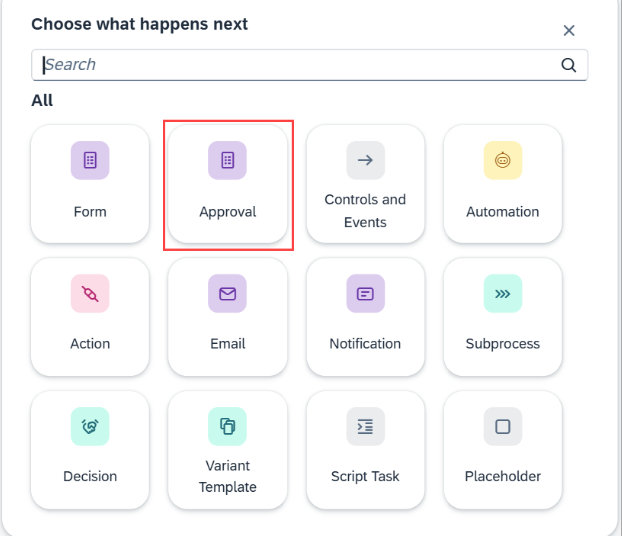

# Build Your First Business Process with SAP Build Process Automation

Overview:

* Create Project
* Create Project
* Form trigger
* Approval
* Auto approval based on condition

1. Create subscription of BPA
2. Add roles to the user - `ProcessAutomationAdmin`, `ProcessAutomationDeveloper` and `ProcessAutomationParticipant`
3. Go to Build ⇒ Lobby ⇒ Create Project ⇒ Type ⇒ Process
4. Inside the project ⇒ Create Business process ⇒ Add Trigger ⇒ Submit a Form

**Different Triggers:**

* Submit a Form
* API Trigger
* Wait for an Event
* Scheduled Trigger

5. In the trigger event ⇒ Create new Form ⇒ Blank Form ⇒ Open Editor
6. Add the paragraphs and the required fields
7. Go to general tab ⇒ Add the Subject and Recipient&#x20;
8. Do the mapping for fields
9. Add an approval form ⇒ The fields from the form to be shown in approval&#x20;

*

    <figure><figcaption></figcaption></figure>

10. Design the Approval form ⇒ Add subject ⇒ Map input ⇒ Add recipient
11. Add form for Approve path and Reject path
12. We can also add a process condition ⇒ Use Control and Events ⇒ Condition
13.

    <figure><figcaption></figcaption></figure>
14. If condition is true then add Auto confirmation form and end step
15. Release the project
16. Deploy ⇒ Select the environment
17. From Deployed Project get the URL ⇒ Trigger the process
18. Lobby ⇒ Monitoring ⇒ Process and Workflow Instances
19.

    <figure><figcaption></figcaption></figure>
20. Click on My Inbox icon from Lobby ⇒ To go to My Inbox
