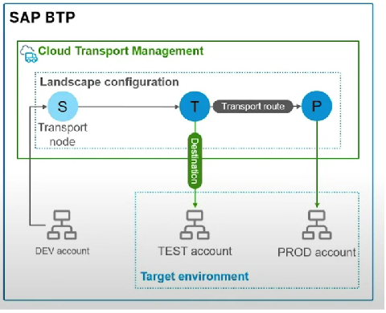
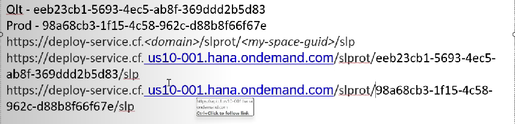
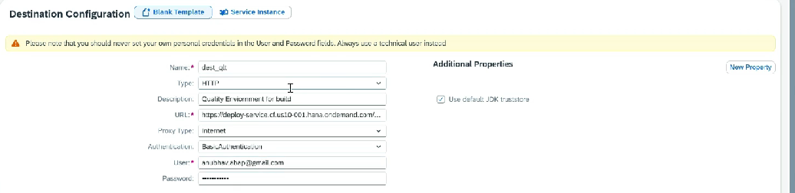
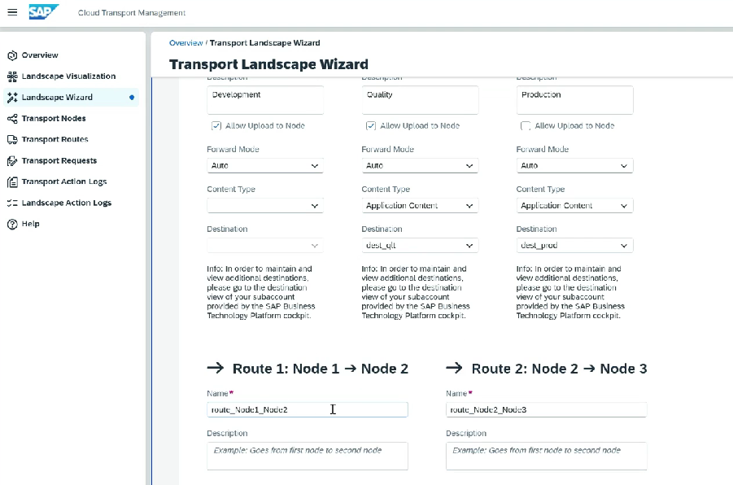

# Cloud Transport Management System

* CTMS tenant needs to be set up in advance
*   Best practise is to set up in different sub account

    <figure><figcaption></figcaption></figure>
* Create a subscription for Cloud Transport Management
* Add roles ⇒ TMS\*
* Create space for QLT and PROD
* Note down the space id
*

    <figure><figcaption></figcaption></figure>
* Create destination&#x20;
*

    <figure><figcaption></figcaption></figure>

*

    <figure><figcaption></figcaption></figure>
* Launch the cloud transport cockpit and configure landscape and route
*

    <figure><figcaption></figcaption></figure>
* Create instance of Content Agent Service
* Create service key
* Create destination as TransportManagementService ⇒ This acts a connection with CTMS
*
*
