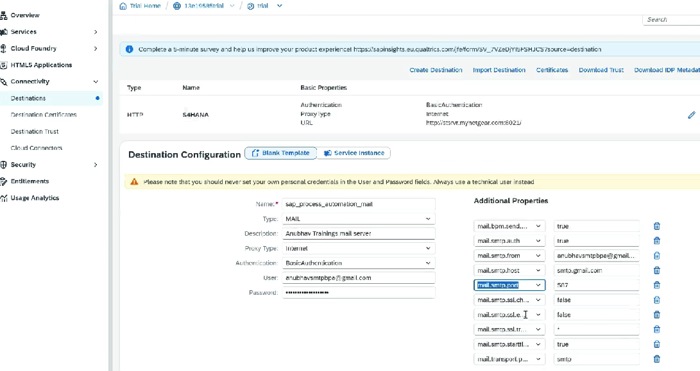

# Configuring the SMTP mail destination

* A mail step is executed without user action
* Example - When a manager approves leaves then employee gets an email
* SAP BPA ⇒ Contact mail server ⇒ Mail server will send mail
* Communication between BPA and mail server will happen using Destination
* **Destination needs to be named sap\_processautomation\_mail mandatorily**
* **Steps:**
  * Destination needs to contain mail server host ⇒ example smtp.sap.corp
* Configuration for gmail:
  * Go into gmail account
  * Manage google account ⇒ 2 factor authentication Enable
  * Passkey should not be set
  * Create app password
  * Create destination **sap\_processautomation\_mai** as per the documentation
  * Here we need to enter app password
  * Build ⇒ Control Tower ⇒ Environment ⇒ Mail server ⇒ We can trigger test mail here
  *

      <figure><figcaption></figcaption></figure>
