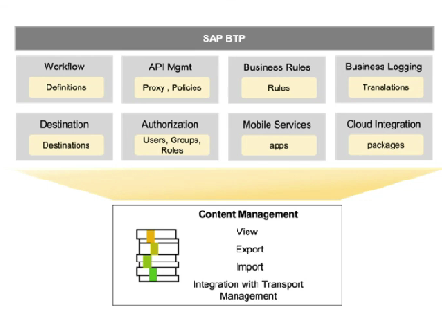

# Content Management Service

* A tool that acts as a local agent and operates at sub account level for managing content operations for different SAP BTP services
*   Acts as a link between BUILD content and the CTMS, providing the necessary functionality to export and import the content from and to the CTMS

    <figure><figcaption></figcaption></figure>
