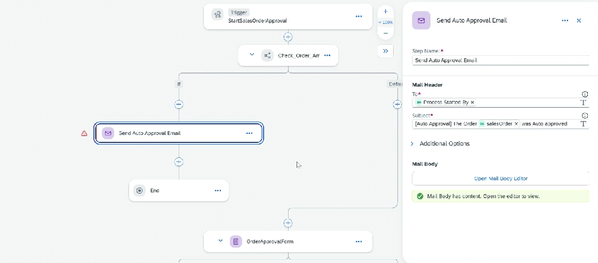

# Control - Example

* If the sales order < 500 EUR, there is no approval required, a direct email will be sent to initiator that order was auto approved
* For this we will be Condition in the flow
* After making the changes, release and deploy
*   Since this is a small change, it will be patch

    <figure><figcaption></figcaption></figure>

