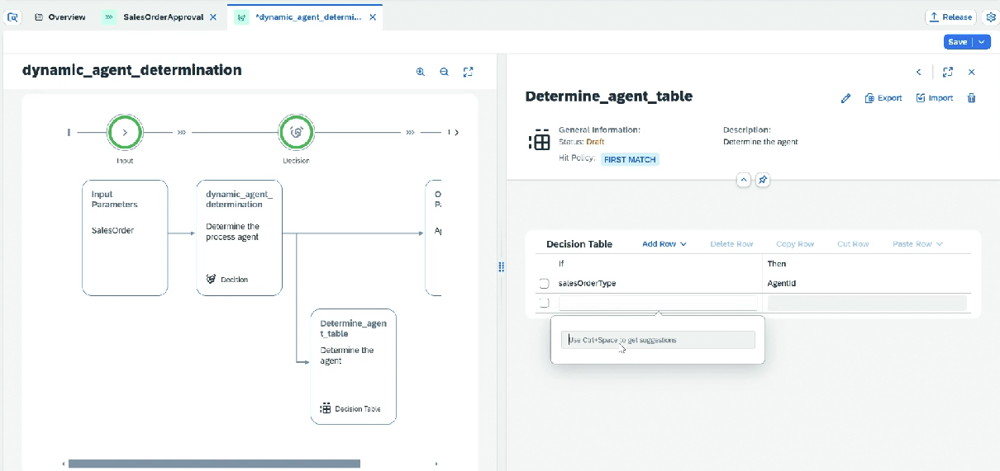

# Decision Table - Steps

* Project ⇒ Editable
* Create ⇒ Decision step

1. Define Input and Output parameter here
2. Define Rule
   1. Hit policy — All or First Match
   2. Rule category — Orchestrated
   3. Configure condition
   4. Result
3. Conditions&#x20;
4. Now in Decision table we can enter the value

<figure><figcaption></figcaption></figure>

<figure><figcaption></figcaption></figure>

* We will add this in the very beggining of our process
* Add a decision&#x20;
* Bind Input and Output(for output create a new variable)
* Release the decision table created
* Save and release the process
