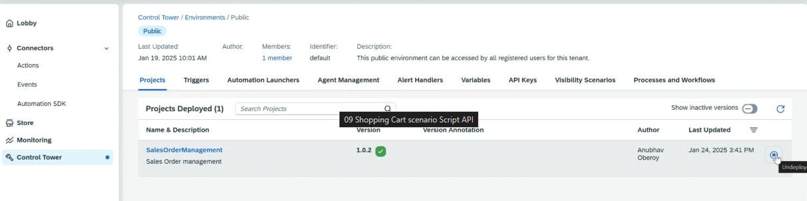

# Delete/Deploy/Export Project

* We need to undeploy project from all the environment and then only we can delete the project
*

    <figure><figcaption></figcaption></figure>
* We can also export the project from build, and similarly import as well
