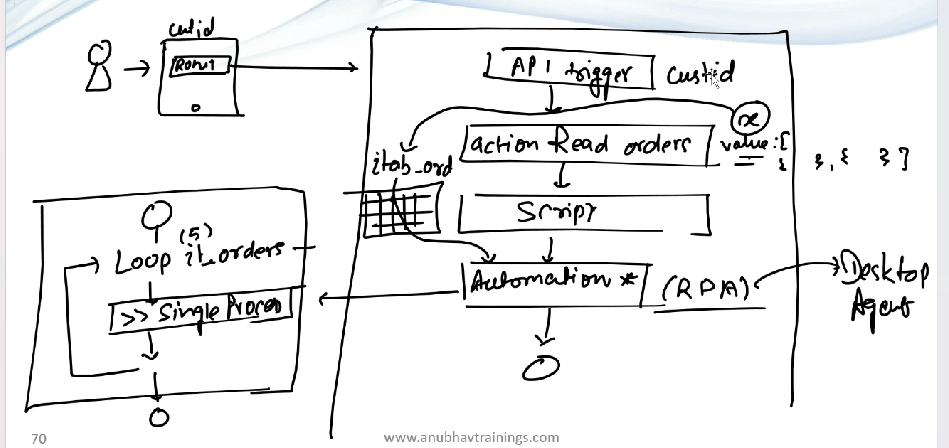

# Design

* Customer Id entered
* BPA will be triggered
* Using API read all the orders of the customer
* Script action to map data to local data ⇒ it\_order
* Start Automation
  * Loop over the data ⇒ it\_order
  * Inside the loop call the single order API ⇒ This becomes sub process
* This automation is done by RPA ⇒ Desktop agent
*

    <figure><figcaption></figcaption></figure>
