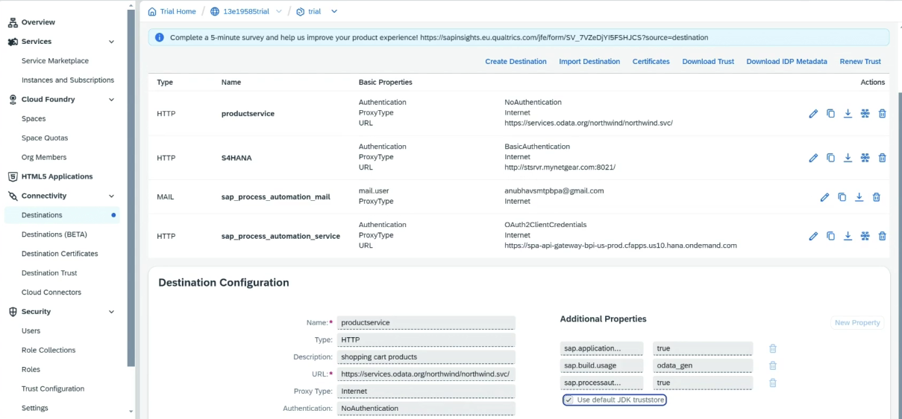

# Destination for Odata

* BTP Cockpit ⇒ Destination
* Create, use URL - [https://services.odata.org/Northwind/Northwind.svc/](https://services.odata.org/Northwind/Northwind.svc/Products?$format=json)
* Add properties
* Authentication method
* Map the destination to the environment
*

    <figure><figcaption></figcaption></figure>
