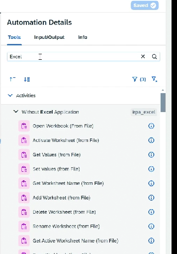
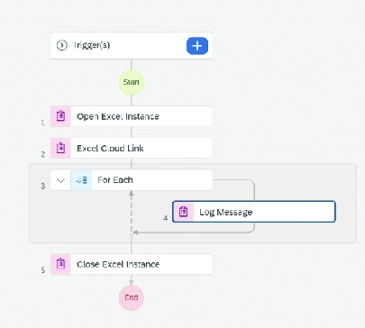

# Excel Link

* Create new project of business process
* Add form trigger
* Add automation step
* In Input - Add parameter for file path
* In tools - we can get all the available option
* Add Open Excel
*   Add Excel Helper

    <figure><figcaption></figcaption></figure>

* Add it in our automation
* It will ask for sample file
*   Also create data type ⇒ this will be of what records will be there in each record

    <figure><figcaption></figcaption></figure>
* After that each loop record
* We can add a Log Message to display the record
*

    <figure><figcaption></figcaption></figure>
* Add Close Excel
*
