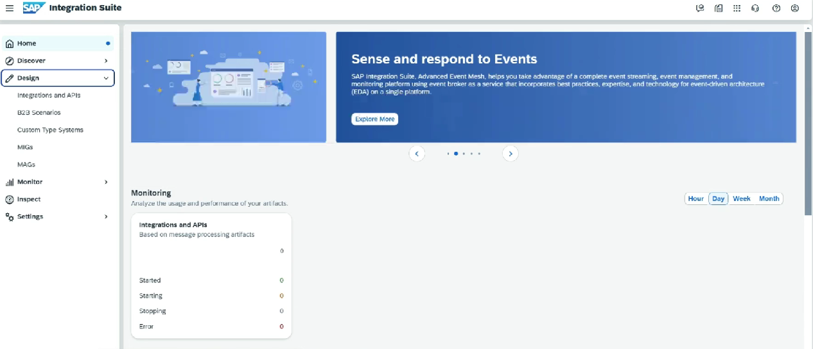
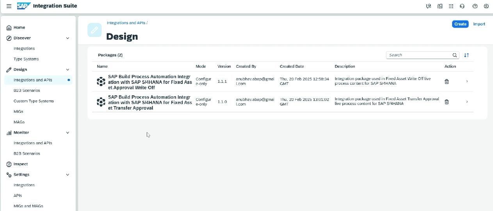
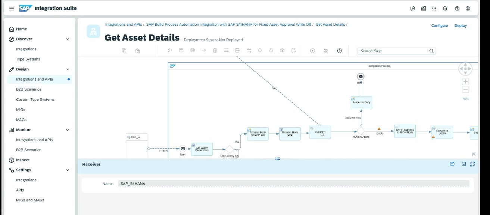

# Integration Suite

* Subaccount ⇒ Service and instance ⇒ Create ⇒ Integration Suite
* Add role collection to the user
*

    <figure><figcaption></figcaption></figure>
*

    <figure><figcaption></figcaption></figure>
* Note down the destination which are getting called
*

    <figure><figcaption></figcaption></figure>
