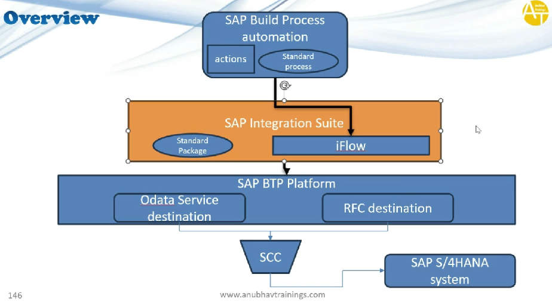

# Integration Suite

* We have BPA on BTP
* We have deployed standard scenario for asset transfer on BPA
* This also deployed actions ⇒ They cannot connect to HANA directly
* For this we need to create 2 destination ⇒ Odata and RFC destination
* For both of them cloud connector will be used
* We also have SAP integration suite in between
* It allows to connect on premise and cloud systems together
* In integration suite, standard package needs to be import ⇒ iFlow
* iFlow ⇒ integration flow ⇒ Sequence of steps to communicate to SAP backend system with odata or bapi
*

    <figure><figcaption></figcaption></figure>
