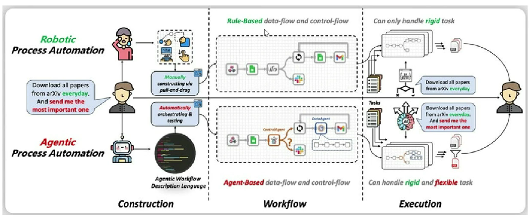
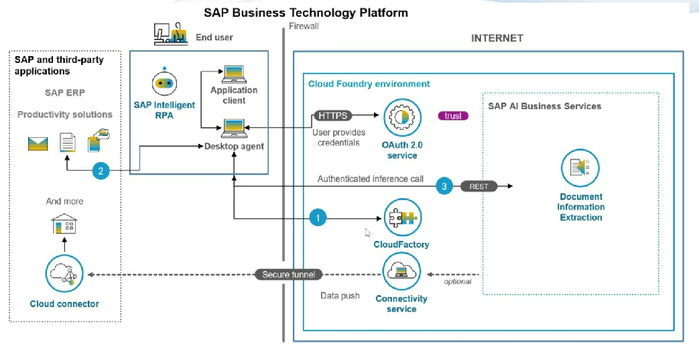

# iRPA

* Used to automate mundane and complicated business processes
* RPA uses software robots to automate the boring stuff done by humans such as data entry, transaction processing, web scrapping and so forth
* We need to install desktop client
* This needs to be mapped with out BTP sub account
*   RPA agent can interact with our applications to read/write data

    <figure><figcaption></figcaption></figure>
*

    <figure><figcaption></figcaption></figure>
