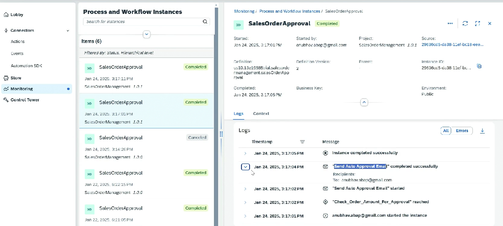

# Monitoring

* Build Lobby ⇒ Monitoring ⇒ Process and workflow instance
* Different status ⇒ On Hold, Running, Error
* We can also check the context and errors&#x20;
* We can also cancel or put on hold
* If we cancel then it wont appear in the Inbox
* It cannot be retrieved once cancelled, on hold can be retrieved
*   In the logs we can see which step executed or which branch taken

    <figure><figcaption></figcaption></figure>
