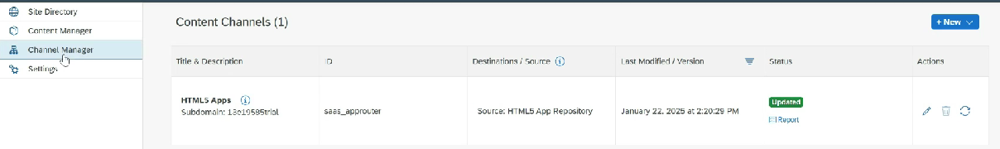

# My Inbox

* Fiori application that provides a centralized view for managing tasks and notifications within the system

1. Task management: Can be related to business workflows, approvals or notifications
2. Integration with SAP workflow
3. User friendly interface
4. Real time updates

* Once the destination is created, go into workzone
* Channel manager ⇒ Refresh
*

    <figure><figcaption></figcaption></figure>
* Content manager ⇒ Here we can view My Inbox and Add
* Content manager ⇒ Everyone role ⇒ Enable the app visibility
* Content manager ⇒ Create Catalog&#x20;
* Content manager ⇒ Create group
* Now if we go into site, My Inbox will be visible
