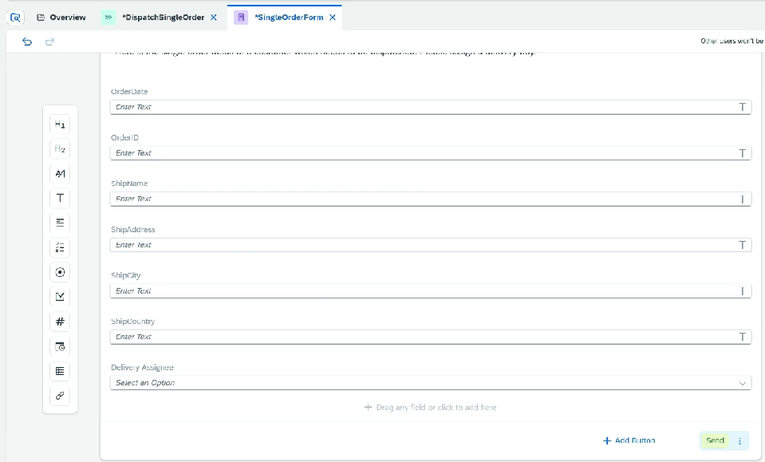
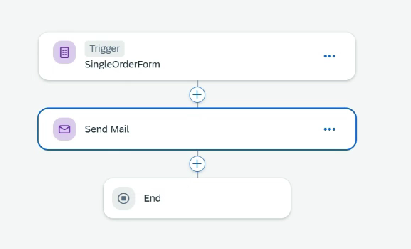
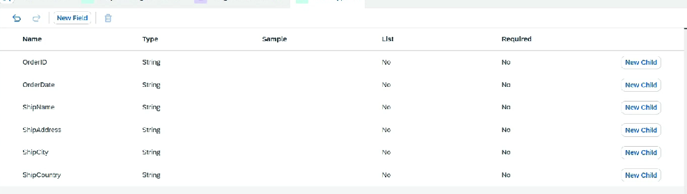
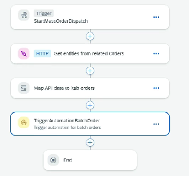
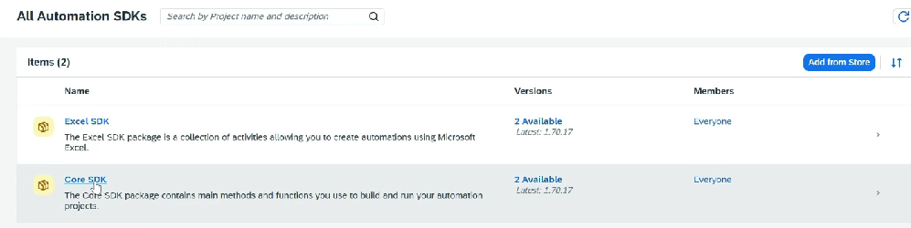
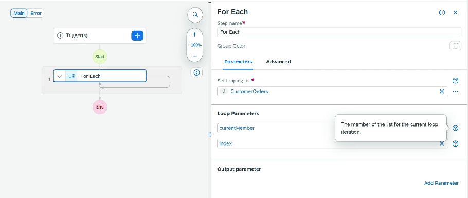

# Project

* Build Lobby ⇒ Create Project ⇒ Business Process
* Create Process ⇒ For single order dispatch
* Add a form trigger
* In this form we will take single form details for dispatch
* We can add a dropdown field for Delivery Boy ⇒ We can assign to a data source or also add manually
* Add a button for Submit
*

    <figure><figcaption></figcaption></figure>

* Add a step that order has been dispatched
*

    <figure><figcaption></figcaption></figure>

* Save, Release, Deploy
* Once deployer inside project, process, we will get a link using which we can test it

Multiple Order:

* Again go into Process ⇒ Editable
* Add a new data type for ordertype
* Add fields like order number,&#x20;
*

    <figure><figcaption></figcaption></figure>
* Now again create a new data type
* TT\_Order type and it data type as above created data type and make it as type list
* Create a new process for mass processing
* Add input ⇒ CustomerId
* Add API trigger with customerid as input
* Go into actions which was created earlier
* Add a new action for customer order ⇒ in this we can pass customer id
* We can add $select in this we can select which fields we want
* Publish the action
* In our process now we use this action
* Create destination variable, map input, create custom variable for order data
* Add script task ⇒ Map all the data coming from api into our custom data type
* Add Automation Step
* Configure Agent Version
* Here choose the agent version which was registered
*

    <figure><figcaption></figcaption></figure>
*

    <figure><figcaption></figcaption></figure>
*
* Lots of activities can be done using Automation, these methods come SDK which get auto installed
*

    <figure><figcaption></figcaption></figure>
* Define input type
* Put a loop on it, using For each
* Structure for loop is auto created
*

    <figure><figcaption></figcaption></figure>
* Drop the process into loop, so that it will execute on the loop
* Save, Release, Publish, Deploy
* Test by triggering API passing customerId
