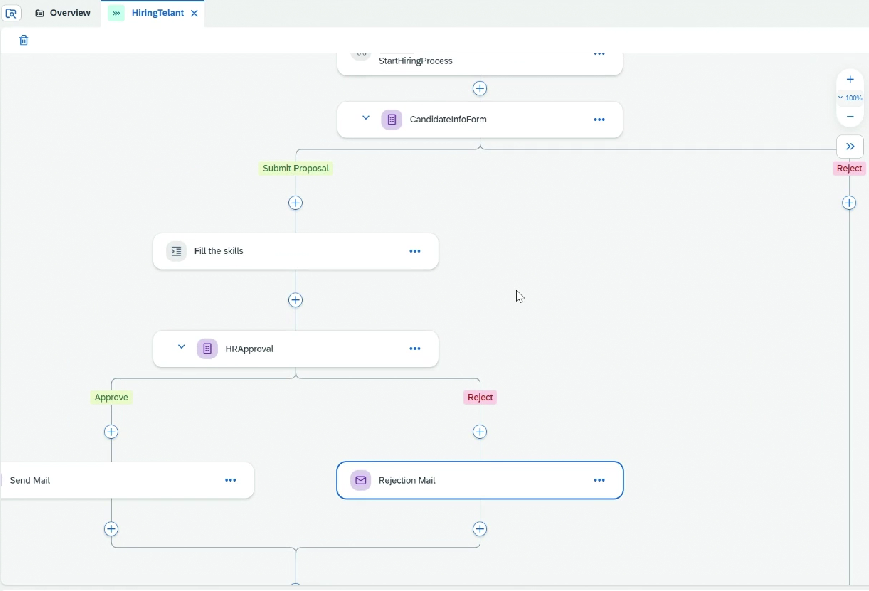

# Project - Custom UI Task

* Create a Process
* Click on Import Form
* Give the Application Id of form created and id
*

    <figure><figcaption></figcaption></figure>
* Create Data Type HiringInfo
  * name
  * employerName
  * workexperience
  * email
  * country
  * budgest
  * skills ⇒ List of string
  * comment
* Add Variables ⇒ Process Input
* Create API trigger
* Add Approval Form ⇒ Here our custom form will be visible
* On submit, it will go for approval
*

    <figure><figcaption></figcaption></figure>
* Save, Release, Deploy
* From Control tower, get the API and trigger by passing the payload
* When triggered, candidate will 1st get the form to fill in his My Inbox
