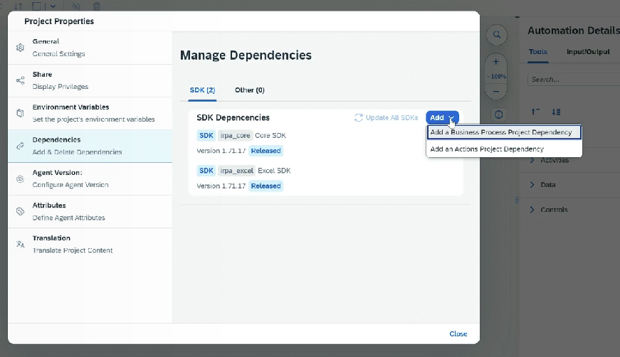
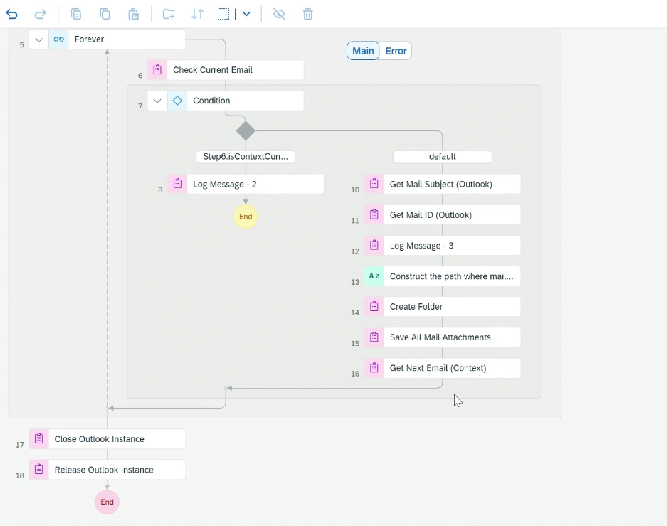

# Project - Download all mail attachments

* Create Project ⇒ Create Task Automation
* Select Agent version
* Add Outlook SDK
*

    <figure><figcaption></figcaption></figure>
* Add Open Outlook
* Search email ⇒ Add search criteria
* Get email numbers (It will give number of email as per search criteria)
* Log message ⇒ Print no. of emails
* Add forever loop ⇒ Add exit condition ⇒ if contextcurrentemail is initial then come out of loop
* For each mail
  * Get mail id
  * Get mail subject
  * Log message - Mail id + Subject
  * Construct path for downloading
  * Create folder
  * Save all mail attachments
*

    <figure><figcaption></figcaption></figure>
*
