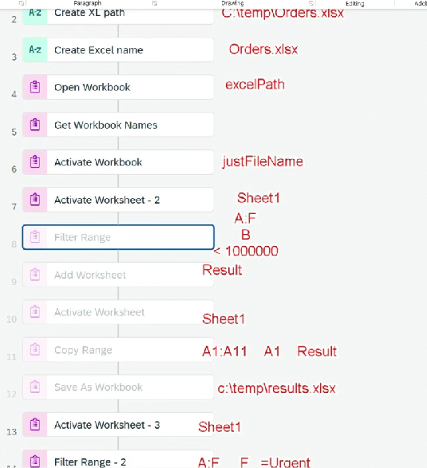

# Project - Excel Automation

**Requirement:**

* Read all the sales orders from an excel file he receives
* Filter all the orders which are at urgent status
* Send an email to corresponding customer on order delivery date
* In addition, filters orders with amount > 10000000 and create a new sheet in excel as Results
* Keet the excel in his system

**Steps:**

* Create Automation step
* Add Open Excel Instance
* Create variable for filepath
* Create variable for filename
* Create variable for sheetname
* Open Workbook ⇒ Here we need to provide path
* Activate worksheet ⇒ Pass sheetname
* Filter Range: Enter criteria that we want grater than 1 million
* Add worksheet
* Activate worksheet - 2
* Copy range
* Save as workbook
* Add Close Excel Instance
*

    <figure><figcaption></figcaption></figure>
