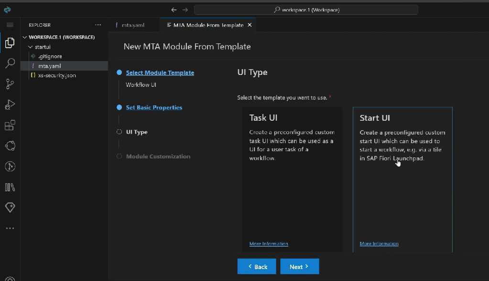

# Project - Fiori Application to Start Build Process

1. Start the BAS tool, click burger icon ⇒ Help ⇒ Get Started
2. Start Project from template ⇒ Create MTA application
3. Right click on mta.yaml file and choose add mta module and add the app router configuration
4. Right click on mta.yaml file and choose add mta module and select workflow UI
5. Enter the project name, select template as start UI

*

    <figure><figcaption></figcaption></figure>

6. Changes to be done, to trigger business process as per the input&#x20;
7. This Custom Application can also be deployed as a Tile in Build Workzone
