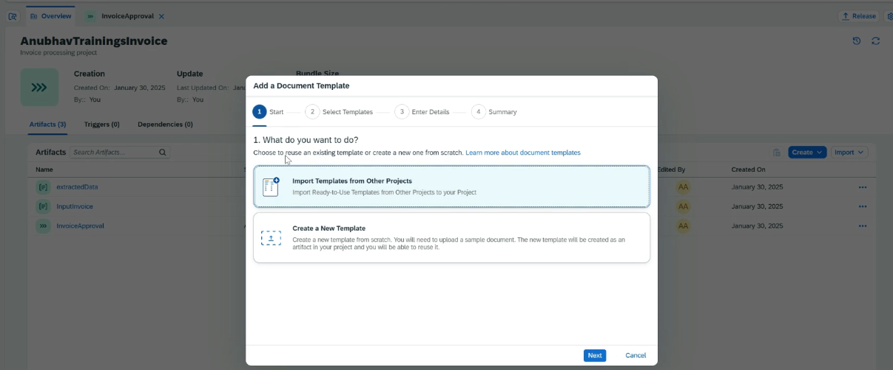
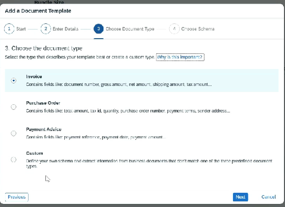
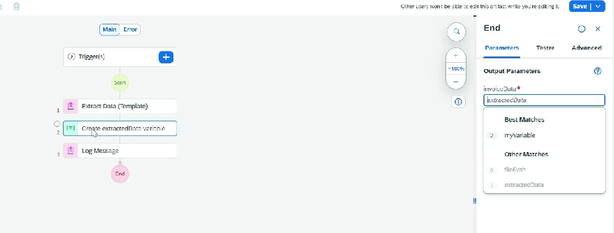
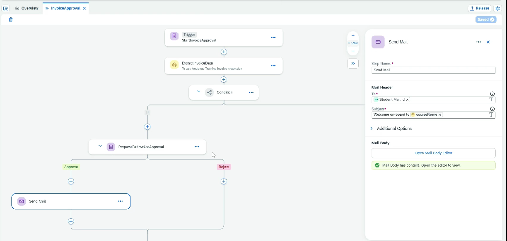

# Project - Invoice Approval

* Create Project ⇒ Create Build Process
* Create Data Type
  * Name
  * Date
  * Filepath
* Create Data Type ⇒ To hold information for approval
  * ExtractedData ⇒ email, amount, course name, date
* Create Document Template
  * Create New Template
  *

      <figure><figcaption></figcaption></figure>

      <figure><figcaption></figcaption></figure>
* **SDK will get added, and we can also see that dependencies gets added**
* Annotate the document
* Add Automation Step
  * Add Extraction&#x20;
  * Map the fields coming from Extraction into our custom data types
  * Log&#x20;
  *

      <figure><figcaption></figcaption></figure>
* Test the Automation by passing the file path
* Add condition step ⇒ if data matches then send for approval
*

    <figure><figcaption></figcaption></figure>
*
