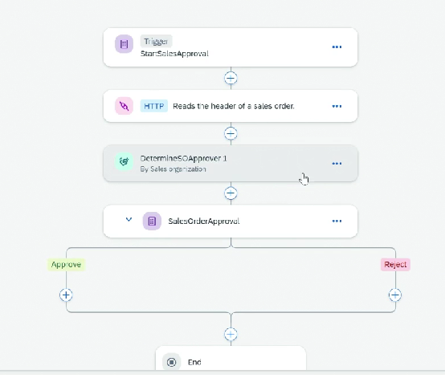
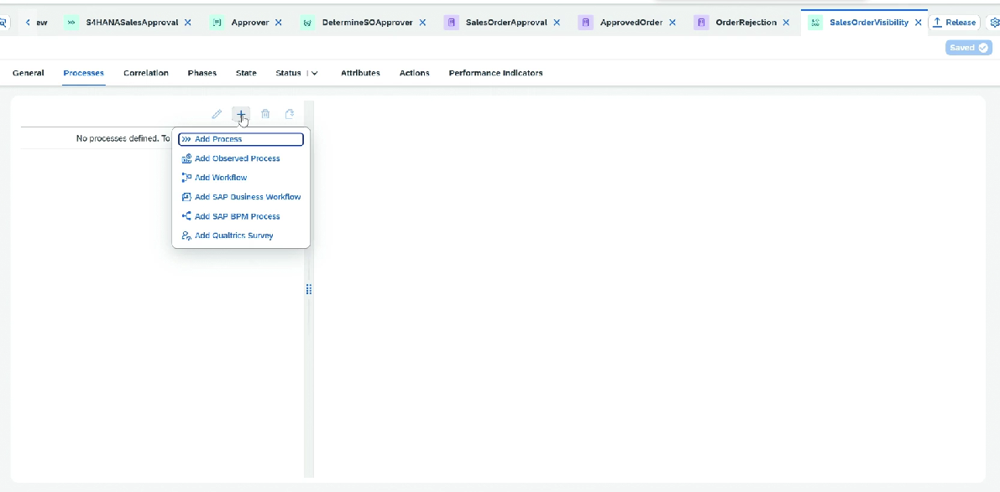
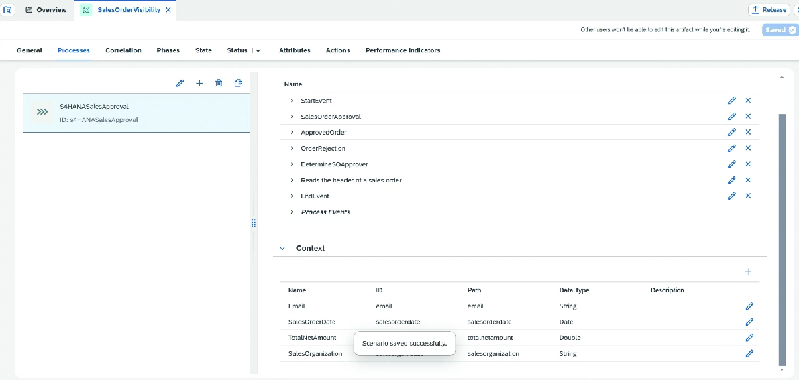
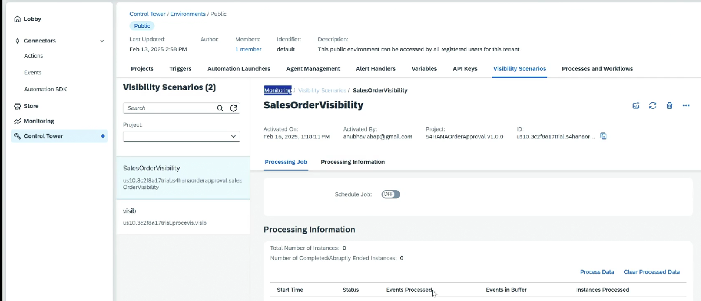
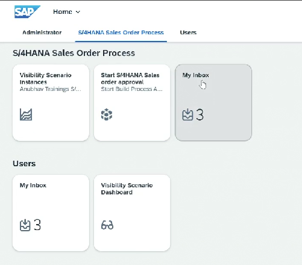
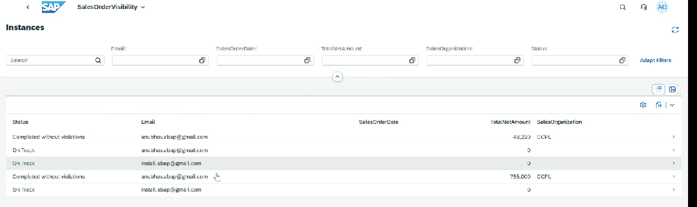

# Project - Process Visibility - Solution

* Create Project ⇒ Create Process
* Create form trigger ⇒ Design form ⇒ Input order number on screen
* Add action&#x20;
* Creation destination variable
* Map input
* Create custom variable
* Output we will map to this custom variable
* Create a data type for Approver
* Create decision, determine approver based on sales org
* Create rule for this
*   In the process, add attributes ⇒ This will be used in visibility

    <figure><figcaption></figcaption></figure>
* Now create a visibility scenario
*   Add process here,&#x20;

    <figure><figcaption></figcaption></figure>
*

    <figure><figcaption></figcaption></figure>
* Go into workzone
* Content Manager ⇒ Process trigger
* Create a local copy of it
* GIve Application tile name
* In navigation, enter uri ⇒ this we will be getting from form of deployed process
* Similarly we also Visibility scenario ⇒ copy it
* Enter scenario id ⇒ this we will get from control tower
*   We also need to schedule job (Need paid plan) or do process data then only data will refresh in visibility

    <figure><figcaption></figcaption></figure>
* Add this tiles in Catalog
* Add in everyone role
*

    <figure><figcaption></figcaption></figure>
*

    <figure><figcaption></figcaption></figure>
