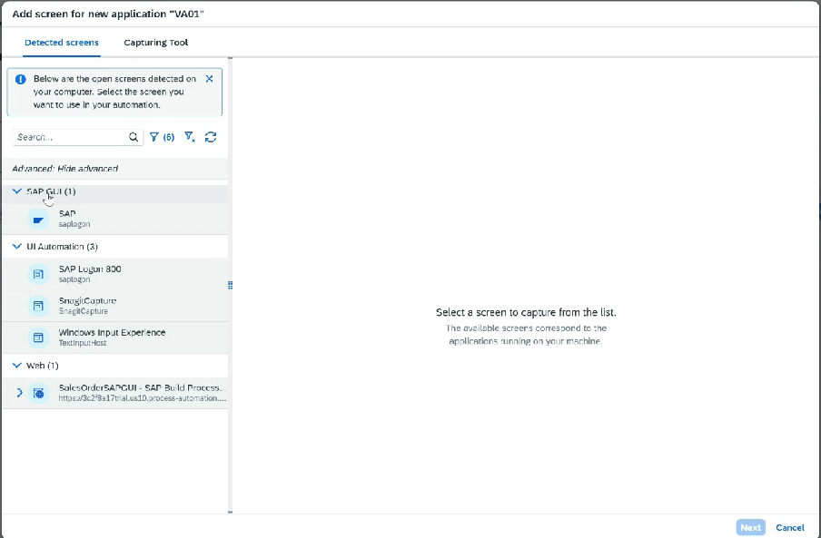
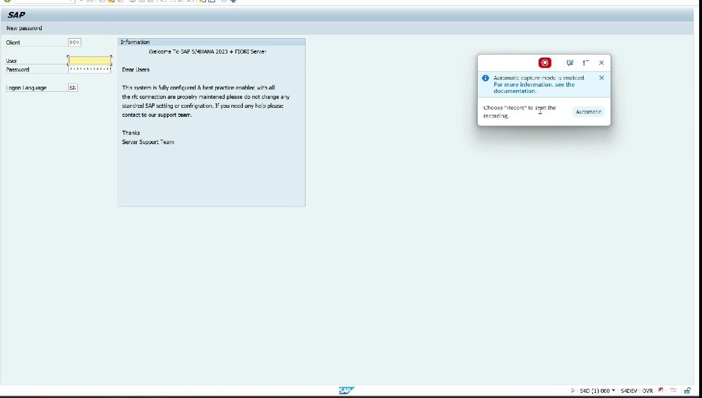
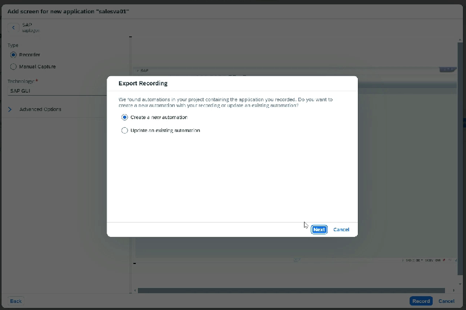
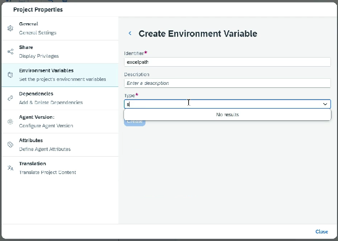
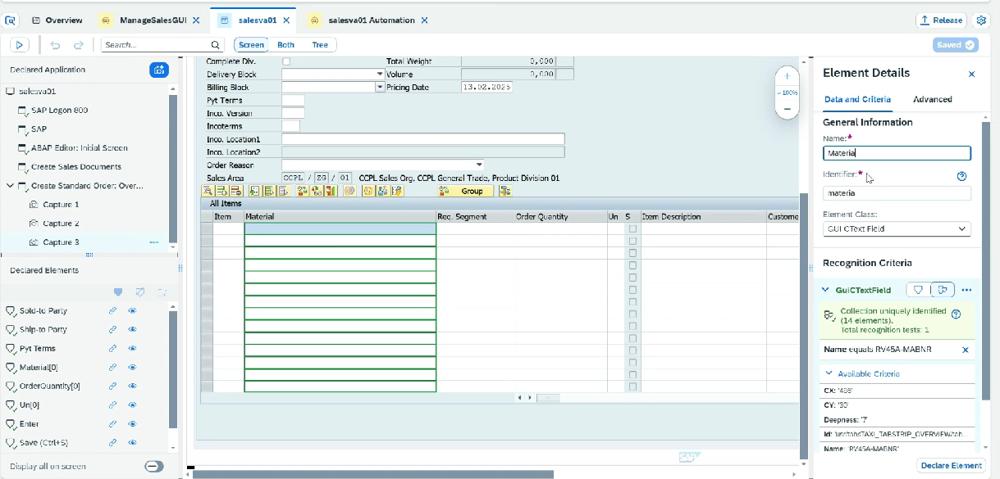
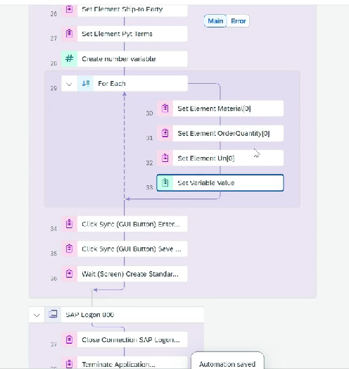

# Project - SAP GUI Automation

* Create Project ⇒ Create Task Automation ⇒ Select Agent Version
* Create Application
* It will detect SAP sessions also
*

    <figure><figcaption></figcaption></figure>
* We need to start from SAP Logon
*   Capture

    <figure><figcaption></figcaption></figure>
* Do all the activities, stop and export
*   Create a new automation

    <figure><figcaption></figcaption></figure>
* Create environment variables ⇒ file path, password
*   &#x20;

    <figure><figcaption></figcaption></figure>
* Add Open excel instance
* Add Excel Cloud Link
* Make modification in recording, as we need to enter multiple records for material
*   Mark the fields as collection

    <figure><figcaption></figcaption></figure>
* Add a loop until
*

    <figure><figcaption></figcaption></figure>
*
