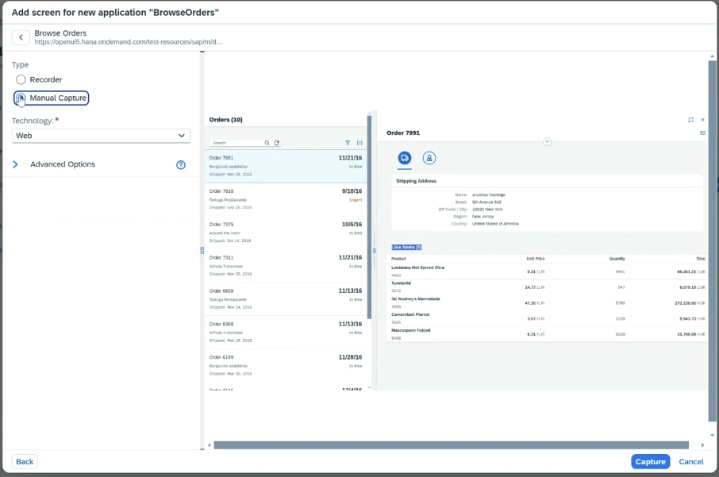

# Project - UI Automation

* Create Project ⇒ Task Automation ⇒ Select Agent
* Add UI5 SDK in dependency
* Inside project ⇒ Import Excel in which we want the data
* Inside project ⇒ Create Application
  * This will check all the session for applications which are open
  *   This will capture the DOM

      <figure><figcaption></figcaption></figure>
* One by one we need to select the elements which we need to capture
*

    <figure><figcaption></figcaption></figure>
* For table we need to use looping mechanism ⇒ We need to mark \<tr> as collection
* In Our Automation
  * Add Screen created above
  * Get the elements
  * In Log message, display the data
* After this, we need to add this data in excel and download it
