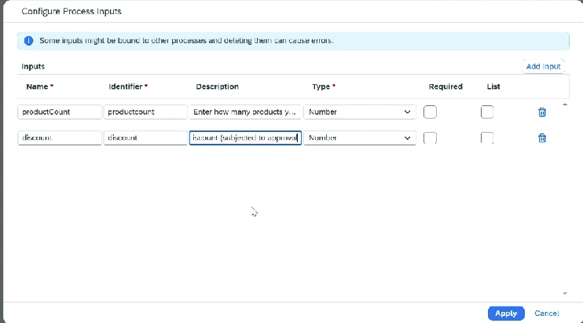
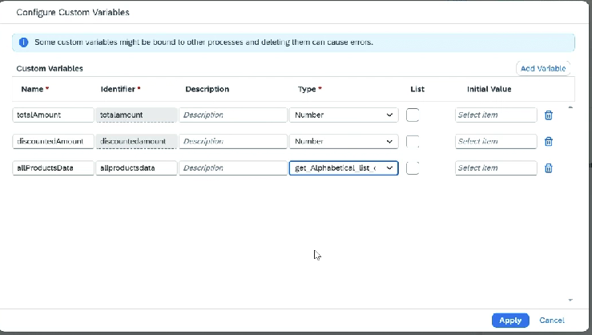
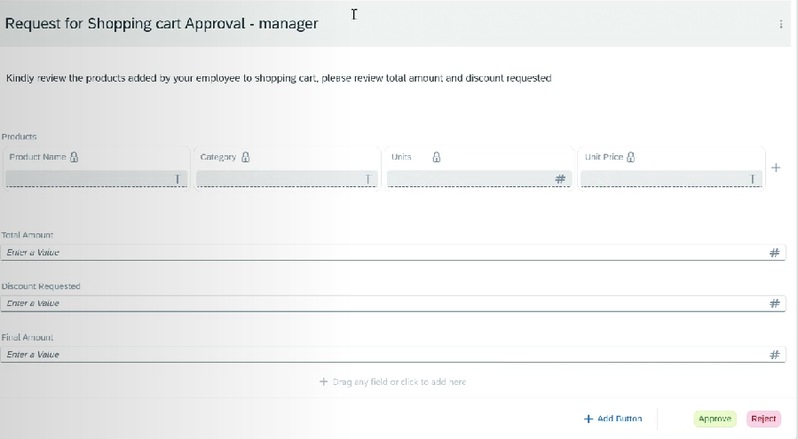
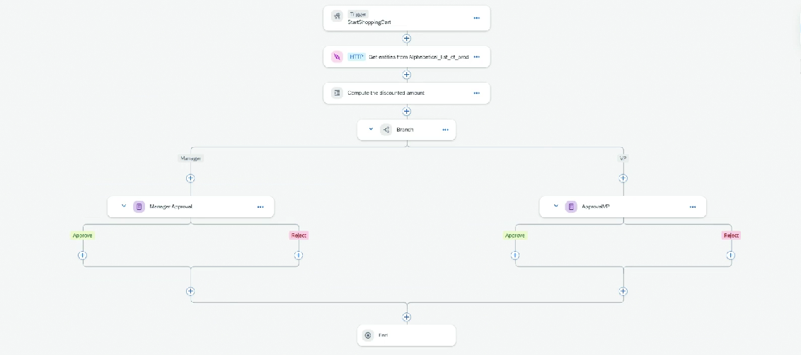

# Project

* Create a project, and create a process under it
* Define the input for the process ProductCount, Discount
* Create an API trigger
* Add an action step ⇒ Select the action which we had created
* Once imported, its data types and properties will also be avialble to us
*   We will also create customvariable for total amount, discountedamount, productdata use data type from action for this

    <figure><figcaption></figcaption></figure>

*

    <figure><figcaption></figcaption></figure>
* For the action project, we need to provide destination
* Map input and output variables
* Add next step for Script task ⇒ To compute discount and total amount
* Code needs to be written in java script
*

    <figure><figcaption></figcaption></figure>
* We can test by setting test variable and check the outputs
* Add a branch step
* In the 1st branch ⇒ Add Approval Form For Manager
* In the 2nd branch ⇒ Add Approval Form For VP
* In the form we can add table also
*

    <figure><figcaption></figcaption></figure>
* Once form created then do the binding
* In VP approval add Deadline monitoring also
* If not acted before Deadline then it will proceed with flow
*

    <figure><figcaption></figcaption></figure>
* Save, Release, Publish
* During Publish it will ask for Destination

Test:

* Control Tower ⇒ Environment ⇒ We can see our Project
*
