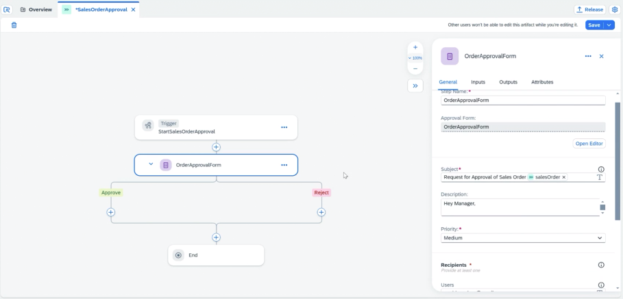
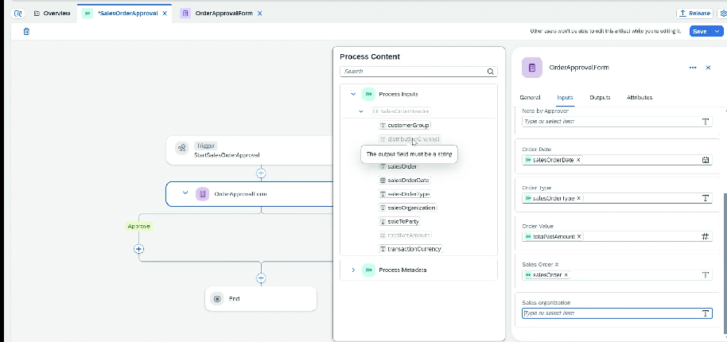

# Sales Order Project

* SAP Build ⇒ New Project ⇒ Name cannot have a space, it can start from any character
* Create Process
* There can be different process in a project like approval, quotation, etc
* Trigger ⇒ API trigger
* Create Data Type ⇒ Import excel with field types or we can do manually also, it takes name, type, required etc
* Fields like sales order should be marked as mandatory
* Click anywhere outside the graph, click on expand button on the right, there we can see variables tab
* Here we will create input, so if we create salesorderheader, then for its data type we will be able to select the data type created earlier in the dropdown
* Add a step for Approval form
* Now form builder will open
* The data fields which we want to bind in the text should be of type string
* We need to specify which user will get it for approval (Later we will be configuring agent)
* We can also configure groups
* Allow forwarding
* Specify due date
* Open form now
*

    <figure><figcaption></figcaption></figure>
* Typically Approval form has Approve and Reject button, we can add additional buttons also
* We can design form here
* We need to design form with fields, mark them as read only or required
* We can also add fields for remarks which can be made editable
* The fields which we marked as read only will be marked as input to the form, and the editable fields will become output of the form
* We need to bind the input fields to the fields from the Process Inputs
*

    <figure><figcaption></figcaption></figure>

* Click on Approve&#x20;
* Create form ⇒ Define subject ⇒ Define recepient
* Here we will add the details for showing to the initiator that his order was approved
* Do the binding
* Here for binding we will also be having the outputs of the previous step
* Similarly create form for reject also
* if any step becomes red then it means there is some error
* Before deploy we need to release project
* It will create a version, this will help in version management
*
