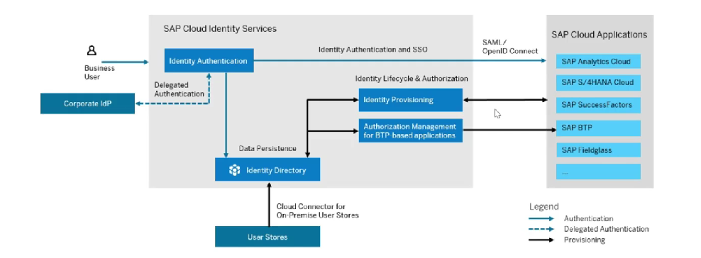

# SAP Cloud Identity Service

* Group of services of BTP, which enables to integrate identity and access management between systems
* The goal is to provide a seamless integration SSO experience across system while ensuring that system and data access are secure&#x20;
* SAP cloud identity service include identity authentication, identity provision, identity directory and authorization management
*

    <figure><figcaption></figcaption></figure>
