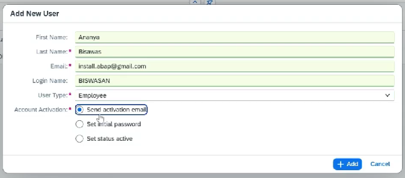

# Setup Build Work Zone

* Booster ⇒ Not available

**Process:**

* Sub account ⇒ Instance and subscription
* We need to subscribe the application with an identity authentication tenant to the subaccount with the "Establish Trust"
* IAM needs to be linked to the subaccount
* Create subscription for Cloud identity service
* Then we need to register ourself as Admin ⇒ so that we can add other user
* Add role collections for Subaccount service admin and Subaccount viewer
* Open cloud identity service subscription, if we try to login then we will get error
* As soon as we create subscription we get a mail for adding activate Admin console
* So we don't have to create 5000 BTP accounts for the user, we can add users here
* We can also make changes to login screen like changing logo etc
*   We can also change template for email like forgot password etc here

    <figure><figcaption></figcaption></figure>
*

    <figure><figcaption></figcaption></figure>
* Trust configuration:
  * Establish Trust
* Create subscription of SAP Workzone ⇒ plan — standard
* Security ⇒ users ⇒ user id ⇒ Add role collection
  * SAP will show relevant roles when we add subscription
  * Launchpad\_Admin ⇒ Full role
  * Launchpad\_Advanced\_Theming
  * Launchpad\_External\_User&#x20;
  * Launchpad\_\*
* Add admin and other user in User again with the identity provider which we configured
* For end user give only Launchpad\_External\_User role
*

    <figure><figcaption></figcaption></figure>
*
* Now we can open the application
* In this there are 4 sections
* **Settings** ⇒ Notification, alias mapping, security headers, custom domain
* **Channel Manager** ⇒ For importing our created application
* **Content Manager** ⇒ For groups and catalog ⇒ customize our site
* **Site directory** ⇒ Create site ⇒ From here we will be getting the link for the users to access the launchpad
