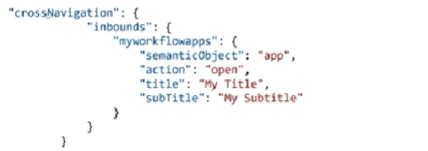

# StartUI

* UI is needed which would allow end users to start the instances of the corresponding workflow
* In addition, the users must be able to specify some arbitrary value that will be used in the contexts of the the started instances
* You can define the start UI using an HTML5 application
*

    <figure><figcaption></figcaption></figure>
