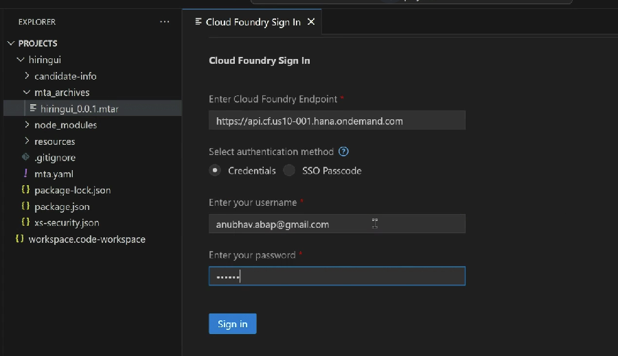

# Steps

1. Create BAS tools dev space with workflow module
2. Open project folder in BAS
3. Create project from template ⇒ New Multi target module
4. Right click on MTA.yaml file and choose add module from template ⇒ App router configuration
5. Right click on MTA.yaml file and choose workflow UI ⇒ Task UI
6. Replace the view content as explained
7. Change flexEnable: false in manifest
8. Add the memory context to the manifest.json at the end
9. Change the root view setting to load Main view
10. Open the main controller and add implementation to set data to context for selected skills in dropdown
11. Open component.js and find method \_patchtaskinstance and add the decision code to be sent&#x20;
12. Right clock on mat.yaml and choose build mtar
13. A mta\_archieve folder gets created, in which we find mtar file which we right click and deploy to BTP
14.

    <figure><figcaption></figcaption></figure>

15. in Subaccount ⇒ Applications ⇒ We will be able to see our application
16. Note down the application id and version, this will be needed in BPA
