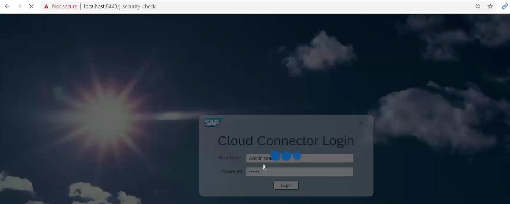
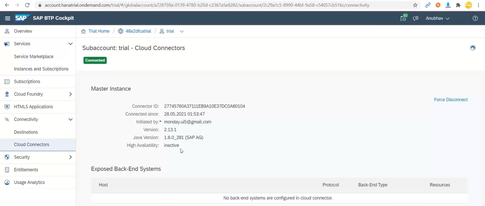
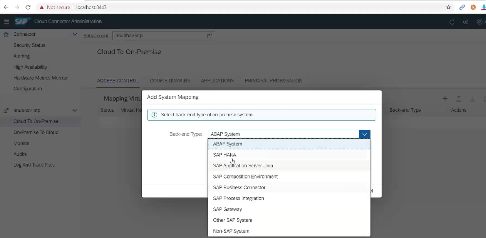
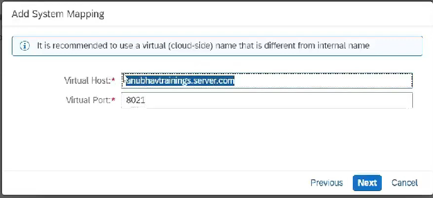
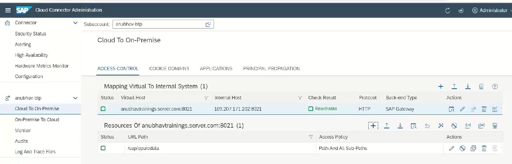
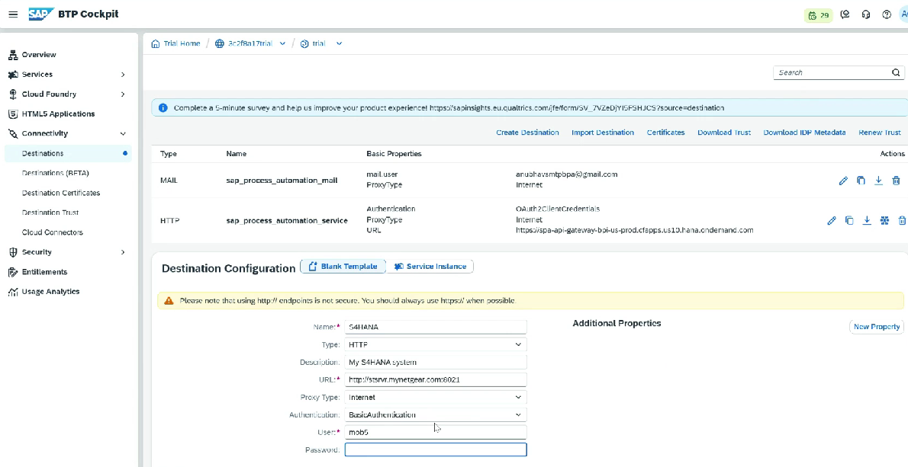

# Steps

**Setting up cloud connector:**

1. Download SAP JVM from hana tools
2. Download Cloud connector from hana tools
3. Place the sapjvm in c drive inside java folder
4. Install cloud connector
5. Note the port number
6. Make sure to select the sap jvm folder during installation
7. Do localhost:8443 this will open cloud connector
8.

    <figure><figcaption></figcaption></figure>
9. Default credentials is Administrator/Manager

**Connect to SAP BTP:**

1.  Enter sub account details like account, username, password etc

    <figure><figcaption></figcaption></figure>
2. Once connected, its visible in cloud connector in BTP

*

    <figure><figcaption></figcaption></figure>

**Connect SAP to On premise system:**

1. You need to provide IP, port etc, Same way we can do RFC connection also
2.  You also need to provide virtual host

    <figure><figcaption></figcaption></figure>

3. This virtual host will be used in destination
4.

    <figure><figcaption></figcaption></figure>

5. Configure which resource we want to expose, like odata path
6.

    <figure><figcaption></figcaption></figure>

**Create Destination:**

* Subaccount ⇒ Connectivity ⇒ Destinations
* Add property sap.processautomationenabled = true
* WebIDEEnable= True
*

    <figure><figcaption></figcaption></figure>
