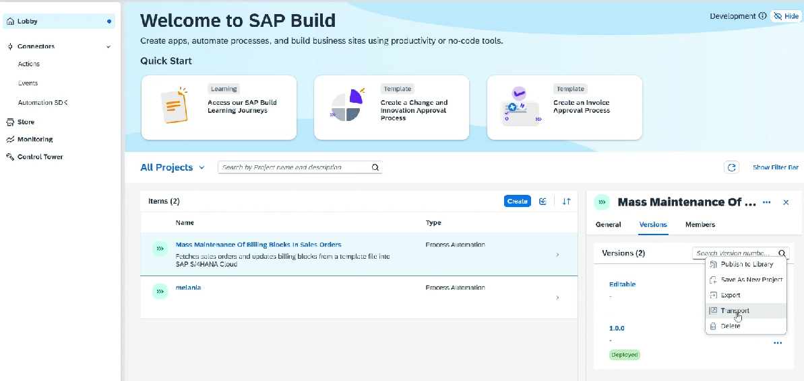
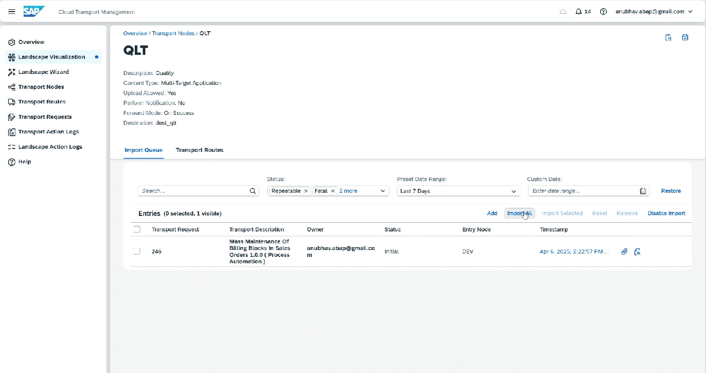
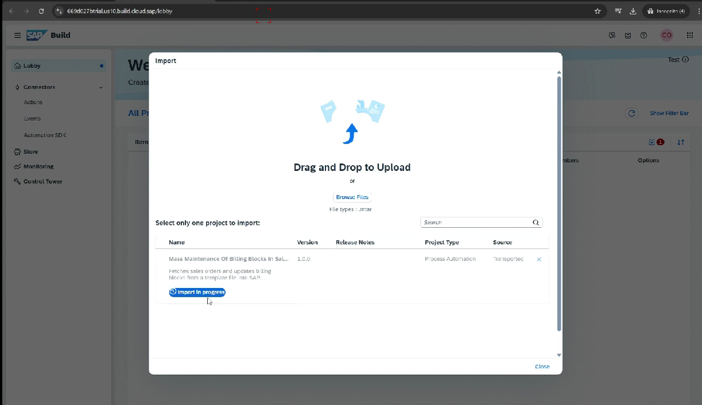

# Transport

* Select the project and click transport
*

    <figure><figcaption></figcaption></figure>
* In QA, select the import
*

    <figure><figcaption></figcaption></figure>
* In QA, go to build lobby and import the project
*

    <figure><figcaption></figcaption></figure>
